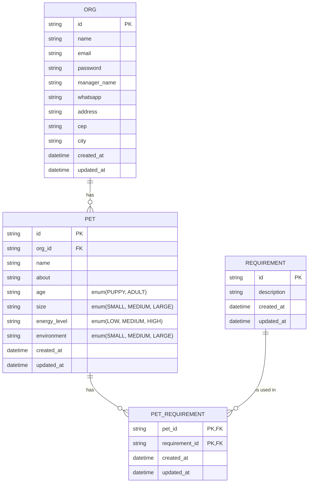

# Find A Friend - API

API para adoção de animais

## Requisitos Funcionais

- [ ] Deve ser possível cadastrar um pet
- [ ] Deve ser possível listar todos os pets disponíveis para adoção em uma cidade
- [ ] Deve ser possível filtrar pets por suas características
- [ ] Deve ser possível visualizar detalhes de um pet para adoção
- [X] Deve ser possível se cadastrar como uma ORG
- [ ] Deve ser possível realizar login como uma ORG

## Regras de Negócio

- [ ] Para listar os pets, obrigatoriamente precisamos informar a cidade
- [X] Uma ORG precisa ter um endereço e um número de WhatsApp
- [ ] Um pet deve estar ligado a uma ORG
- [ ] O usuário que quer adotar, entrará em contato com a ORG via WhatsApp
- [ ] Todos os filtros, além da cidade, são opcionais
- [ ] Para uma ORG acessar a aplicação como admin, ela precisa estar logada

## Requisitos Não-Funcionais

- [X] A senha do usuário precisa estar criptografada
- [X] Os dados da aplicação precisam estar persistidos em um banco PostgreSQL
- [ ] Todas listas de dados precisam estar paginadas com 20 itens por página
- [ ] O usuário deve ser identificado por um JWT

## Diagrama ER
